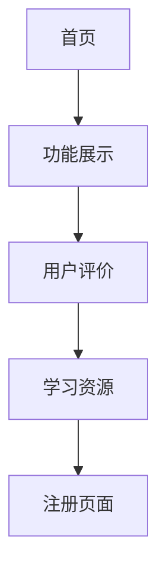

# YouMind 产品需求文档

## 1. 产品概述
YouMind 是一个专业的写作和内容创作平台，旨在为用户提供优质的写作工具和创作环境。产品通过简洁现代的界面设计，帮助用户提升写作效率和创作体验。

## 2. 核心功能

### 2.1 用户角色
本产品主要面向内容创作者，无需复杂的角色区分。

### 2.2 功能模块
产品包含以下主要页面：
1. **首页**：品牌展示、产品介绍、核心功能展示
2. **功能展示页面**：详细介绍各项核心功能
3. **用户反馈页面**：展示用户评价和使用案例
4. **关于我们页面**：公司信息和联系方式

### 2.3 页面详情

| 页面名称 | 模块名称 | 功能描述 |
|----------|----------|----------|
| 首页 | Hero区域 | 主标题"Write something good"，副标题描述，CTA按钮 |
| 首页 | 产品展示区 | 展示写作界面截图，突出产品特色 |
| 首页 | 功能介绍区 | "One place for you"标题，多个功能卡片展示 |
| 首页 | 工具展示区 | 展示不同写作工具和模板 |
| 首页 | 用户评价区 | "Our users love YouMind"，用户头像和评价 |
| 首页 | 学习资源区 | "Learn more about YouMind"，相关文章和资源 |
| 首页 | 底部CTA区 | 再次强调"Write something good"，注册引导 |

## 3. 核心流程
用户访问首页 → 浏览产品功能 → 查看用户评价 → 了解更多信息 → 注册使用

## 4. 用户界面设计

### 4.1 设计风格
- **主色调**：深蓝色 (#1a1a2e)，白色 (#ffffff)
- **辅助色**：浅灰色 (#f8f9fa)，黄色强调色 (#ffd700)
- **按钮样式**：圆角矩形，深色背景
- **字体**：现代无衬线字体，多层级字号
- **布局风格**：卡片式设计，居中对齐，充足留白
- **图标风格**：简约线性图标，手绘插画元素

### 4.2 页面设计概览

| 页面名称 | 模块名称 | UI元素 |
|----------|----------|--------|
| 首页 | 导航栏 | Logo、导航菜单、登录按钮 |
| 首页 | Hero区域 | 大标题、描述文字、主CTA按钮、装饰插画 |
| 首页 | 产品展示 | 产品截图、特性说明、布局网格 |
| 首页 | 功能卡片 | 图标、标题、描述、卡片阴影效果 |
| 首页 | 用户评价 | 用户头像、评价文字、星级评分 |
| 首页 | 底部区域 | 重复CTA、简化导航、版权信息 |

### 4.3 响应式设计
产品采用桌面优先的响应式设计，确保在不同设备上的良好体验，支持触摸交互优化。