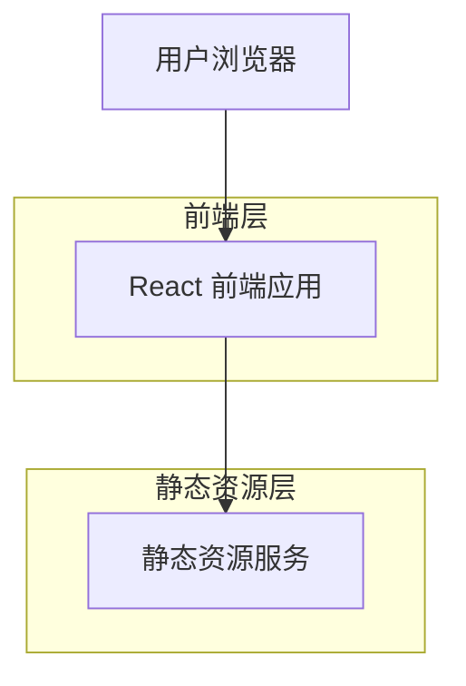

# YouMind 技术架构文档

## 1. 架构设计



## 2. 技术描述

* 前端：React\@18 + TailwindCSS\@3 + Vite

* 后端：无需后端服务

* 部署：静态网站托管

## 3. 路由定义

| 路由             | 用途             |
| -------------- | -------------- |
| /              | 首页，展示产品介绍和核心功能 |
| /#hero         | Hero区域锚点       |
| /#features     | 功能展示区域锚点       |
| /#testimonials | 用户评价区域锚点       |
| /#resources    | 学习资源区域锚点       |

## 4. 组件架构

### 4.1 核心组件结构

```
src/
├── components/
│   ├── Header/
│   │   ├── Navigation.jsx
│   │   └── Logo.jsx
│   ├── Hero/
│   │   ├── HeroSection.jsx
│   │   └── CTAButton.jsx
│   ├── Features/
│   │   ├── FeatureGrid.jsx
│   │   └── FeatureCard.jsx
│   ├── ProductShowcase/
│   │   └── ProductDemo.jsx
│   ├── Testimonials/
│   │   ├── TestimonialGrid.jsx
│   │   └── UserCard.jsx
│   ├── Resources/
│   │   └── ResourceGrid.jsx
│   └── Footer/
│       └── Footer.jsx
├── assets/
│   ├── images/
│   └── icons/
├── styles/
│   └── globals.css
└── App.jsx
```

## 5. 样式系统

### 5.1 TailwindCSS 配置

```javascript
// tailwind.config.js
module.exports = {
  content: ['./src/**/*.{js,jsx,ts,tsx}'],
  theme: {
    extend: {
      colors: {
        primary: '#1a1a2e',
        secondary: '#16213e',
        accent: '#ffd700',
        background: '#ffffff',
        muted: '#f8f9fa'
      },
      fontFamily: {
        sans: ['Inter', 'system-ui', 'sans-serif']
      },
      spacing: {
        '18': '4.5rem',
        '88': '22rem'
      }
    }
  }
}
```

### 5.2 响应式断点

* sm: 640px

* md: 768px

* lg: 1024px

* xl: 1280px

* 2xl: 1536px

## 6. 性能优化

### 6.1 图片优化

* 使用 WebP 格式

* 实现懒加载

* 响应式图片

### 6.2 代码分割

* 路由级别代码分割

* 组件懒加载

### 6.3 构建优化

* Vite 构建工具

* Tree shaking

* 资源压缩

## 7. 部署方案

### 7.1 静态部署

* Vercel / Netlify

* GitHub Pages

* CDN 加速

### 7.2 构建流程

```bash
npm run build
npm run preview
```

